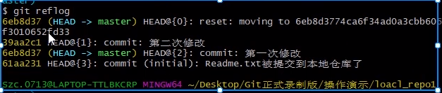
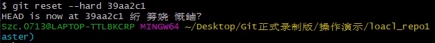

### 基本概念


```
	本地仓库： 在本地主机上的一个代码库，可以独立存在，也可以与远程仓库进行关联

		工作区：对任何文件的修订(增删改)，都先放在工作区，工作区不与任何仓库分支进行关联
		暂存区：把修订的文件，从工作区经过add（添加）后与某一个仓库分支进行关联，只要进入缓存区的文件才能commit(提交)到本地仓库

​	远程仓库：在局域网或互联网上的一个主机，存放代码库的主机或平台，比如GitHub、Gitee.com(码云)
1111111

​	分支：代码存放在仓库，默认是主分支(master)，可以在主分支基础上创建很多子分支，比如develop（开发）、bugfix（bug修复）等
```

#### 创建.git工作目录：


打开git bash here 页面，输入

```
$ git init
```


于是会生成.git文件


#### 添加暂存区文件：

先创建一个a.txt文件


打开git bash here 页面，输入

```
$ git add a.txt
```


然后进入.git文件，会发现多了一个index文件


index就是暂存区

add操作其实就是将文件引入暂存区


#### .git隐藏目录的作用

一个文件夹包含.git隐藏目录（Git工作目录），说明此文件目录使用Git版本管理。.git隐藏目录中存储了很多配置信息、日志信息和文件版本信息、暂存区信息等。.Git文件夹中有很多文
件，其中有一个index文件就是暂存区，也可以叫做stage。暂存区是一个临时保存修改文件的地方。


### 小结

#### Git分布式的版本控制系统

1、Git解决那些问题：代码备份、还原；协同开发；多版本同时开发、追溯问题代码
2、Git中的基本概念：
本地仓库：存储所有版本代码
工作区：编辑代码区
暂存区：准备提交的代码都放这里
远程仓库：用于团队之间共享代码【枢纽】
分支：多个版本同时开发，master主分支，develop开发分支，test测试分支
3、Git工作流程：


#### 远程仓库操作

1.clone(克隆)：第一次从远程仓库下载代码

2.==pull(拉取)：获取团队其他成员代码提交变动==

3.==push(推送)：完成后的代码上传到远程仓库==

#### 本地仓库操作

1.checkout(检出)：将本地仓库的内容检出到工作区

2.==add(添加)：向暂存区添加代码，准备提交==

3.==commit(提交)：把暂存区的代码提交到本地仓库==


### Git基本配置

git的基本配置都要在文件夹下右键打开git bash here 页面进行命令的输入

#### 基本配置

安装完成git之后，使用之前需要进行全局配置，如用户名，邮箱

设置的命令为

```
git config
```

设置全局用户名

```
git config --golbal user.name "your name"
```

设置全局邮箱

```
git config --golbal user.email "your email"	
```

其中， --global 指定为全局配置，不使用该参数，则为当前所在仓库配置。

通过上面的命令设置的信息会保存在.gitconfig文件中


以上配置信息默认存储在用户目录下，如果设置错误，可以删除以下如图文件，重新操作以上命令即
可。


#### 查看配置信息

```
git config --list
```

	


### 构建本地仓库

要使用Git对我们的代码进行版本控制，首先需要构建本地仓库
通常有两种方式：
 1.在本地初始化一个Git仓库
 2.从远程仓库克隆一个仓库 （远程仓库演示）


#### 本地初始化一个Git仓库

1）在电脑的任意位置创建一个空目录（例如local_repo1）作为我们的本地Git仓库
2）进入这个目录中，点击右键打开Git bash窗口
3）执行命令Git init如果在当前目录中看到.git文件夹（此文件夹为隐藏文件夹）则说明Git仓库创建成功


### 本地仓库的操作

####  创建 Git 版本库

在本地创建 Git 版本库，需要使用 git init 命令。
首先，你需要新建一个存放版本库的目录，然后进入到该目录所在路径，然后执行：

```
git init
```

然后查看目录结构中，就可以看到包含有 .git 子目录，这就说明创建版本库成功了


#### 查看当前文件状态

```
git status [-s]
```


更简洁的信息命令形式：

```
git status -s
```


#### 将文件添加到版本库

要将一个文件纳入到版本库管理，首先要将其添加到暂存区，然后才能提交到仓库中。
将文件添加到暂存区，使用的是 git add ：	

```
# 添加单个文件到暂存区
git add Readme.txt
# 将当前目录下所有修改添加到暂存区，除按照规则忽略的之外
git add .
```

注意：这边空文件夹是不会被添加到暂存区中的。


1. 将暂存区中的文件，提交到仓库中。需要使用 git commit ：

```
# 如果暂存区有文件，则将其中的文件提交到仓库
git commit
# 带评论提交，用于说明提交内容、变更、作用等
git commit -m 'your comments'
```

注意：这边直接用 git commit 提交，会先弹出添加评论的页面


可以通过wq返回


提交完成之后会显示提交的信息，如果显示乱码，可以通过右键选择Options更改编码来解决


#### 修改文件

就是再次进行一次添加操作就行


#### 查看提交历史记录

有的时候，是会需要查看自己做过哪些提交，来回顾自己完成的部分。或者需要寻找某个具体的提交来
查看当时的代码。这里需要用到

```
git log # 显示所有提交的历史记录
git log --pretty=oneline # 单行显示提交历史记录的内容
```

在 git log 的输出内容中，可以看到每次提交的 ID，是一个 40 位的字符串。


多行


单行


#### 版本回退

有了 git log 来查看提交的历史记录，我们就可以通过 git reset --hard 来回退到我们需要的特定版本，然后使用当时的代码进行各种操作。

```
# 回退到 commit_id 指定的提交版本
git reset --hard 'commit_id'
```


#### 回到未来的某个提交??

当退回到某个提交的版本以后，再通过 git log 是无法显示在这之后的提交信息的。但是，通过 git
reflog 可以获取到操作命令的历史。
因此，想要回到未来的某个提交，先通过 git reflog 从历史命令中找到想要回到的提交版本的 ID，
然后通过 git reset --hard 来切换。

```
git reflog
git reset --hard 'commit_id'
```


 **举例：**

对Readme.txt进行第二次修改添加内容【修改2】，然后已经回退到第一次修改的状态 


同时打开文件查看Readme.txt


可以看到，回退之后看不到第二次提交的信息，因为对当前版本来说第二次提交是未来版本的

因此用git reflog




要回到之前提交的---第二次提交，就要从git reflog中找到对应的版本id，然后通过git reset --hard来切换



然后打开文件Readme.txt，文件内容已修改为第二次提交的


#### 删除文件

在文件未添加到暂存区之前，对想删除文件可以直接物理删除。如果文件已经被提交，则需要 git rm来删除：

```
git rm Readme.txt # 删除已被提交过的Readme.txt
```

注意： git rm 只能删除已经提交到版本库中的文件。其他状态的文件直接用这个命令操作是出错的


#### 添加文件至忽略列表

一般在工作区中，并不是所有文件都需要纳入版本控制的
这种不需要进行版本控制的通常都是些自动生成的文件。比如：idea工程文件(springmvc.iml)、编译后
文件target、系统上传的图片img。
在这种情况下，我们可以在工作目录中创建一个名为 .gitignore 的文件（文件名称固定），列出要忽略
的文件。


**一般在工程初始化时，提前准备好需要忽略的文件列表**

### 如何将文件推送至远端？

```
git add .
git commit -m '评论'

git remote add origin git@github.com:XianYuW/Java.git 	# 关联到远程库

git pull --rebase origin master	# 获取远程库与本地同步合并
(如果远程库不为空必须做这一步，否则后面的提交会失败)

git push -u origin master	# 本地库的内容推送到远程
```

### 其他指令

```
# 状态查询命令
git status

# git查看远程仓库地址命令
git remote -v

如果想要修改远程仓库地址
	git remote set-url origin git@github.com:mkl34367803/WebAjax.git
	# 然后再push
	git push origin master
```


### 分支管理

```
几乎所有的版本控制系统都以某种形式支持分支。 使用分支意味着你可以把你的工作从开发主线上分离
开来进行重大的Bug修改、开发新的功能，以免影响开发主线。
在开发中，一般有如下分支使用原则与流程：

​	master （生产） 分支
		线上分支，主分支，中小规模项目作为线上运行的应用对应的分支；

​	test（测试）分支
		从master创建的分支，一般作为测试部门的测试分支，进行预发测试。
		测试完成后，需要合并到master分支，进行上线，中小规模项目可省略此分支；

​	develop（开发）分支
		从test创建分支，如果开发没有test分支，是从master创建的分支，一般作为开发部门的主要开发分支
		如果没有其他并行开发不同期上线要求，都可以在此版本进行开发
		阶段开发完成后，需要是合并到test分支继续测试，如果没有test分支，可直接合并到master分支。

​	hotfix(bugfix)分支，
		从master派生的分支，一般作为线上bug修复使用，修复完成后需要合并到master、test、develop分支
```


#### 查看分支

```
# 查看本地分支信息
git branch
# 查看相对详细的本地分支信息
git branch -v
# 查看包括远程仓库在内的分支信息
git branch -av
```

注意：在 git branch 的输出内容中，有一个分支，前面带有 * 号，这标识我们当前所在的分支


#### 创建分支

当我们要修复一个 Bug，或者开发一个新特性，甚至是在初学的时候怕打乱原来的代码，都可以新建一
个分支来避免对原来代码的影响。

```
# 新建一个名为dev的分支
gait branch dev
```


#### 切换分支

当我们创建完分支之后，我们需要切换到新建的分支，否则，所有的修改，还是在原来的分支上。

事实上，所有的改动都只能影响当前所在的分支

```
# 新建完 dev 分支后，通过该命令切换到dev分支
git checkout dev
```


#### 创建并切换分支

```
# 新建 dev 分支，并且切换到该分支上
git checkout -b dev
```

这个命令合并了前两个独立的命令，平时使用一般这样使用


#### 合并分支

当我们修复完成一个 Bug，或者开发完成一个新特性，我们就会把相关的 Bug 或者 特性的上修改合并
回原来的主分支上，这时候就需要 git merge 来做分支的合并。
首先需要切换回最终要合并到的分支，如 master ：

```
# 切换回master分支
git checkout master
# 将dev 分支中的修改合并回 master 分支
git merge dev
```


合并回主分支的时候，后面可能会面临到冲突的问题
git add ./