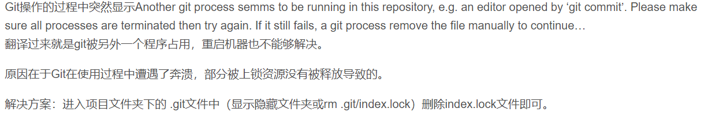

## Git操作失败


# 提示Another git process seems to be running in this...

[借鉴]: https://blog.csdn.net/qq_32193151/article/details/70792594

翻译过来就是

```
git被另外一个程序占用，重启机器也不能够解决。
```

原因

```
在于Git在使用过程中遭遇了奔溃，部分被上锁资源没有被释放导致的。
```

解决方案：

```
进入项目文件夹下的 .git文件中（显示隐藏文件夹或rm .git/index.lock）删除index.lock文件即可。
```



