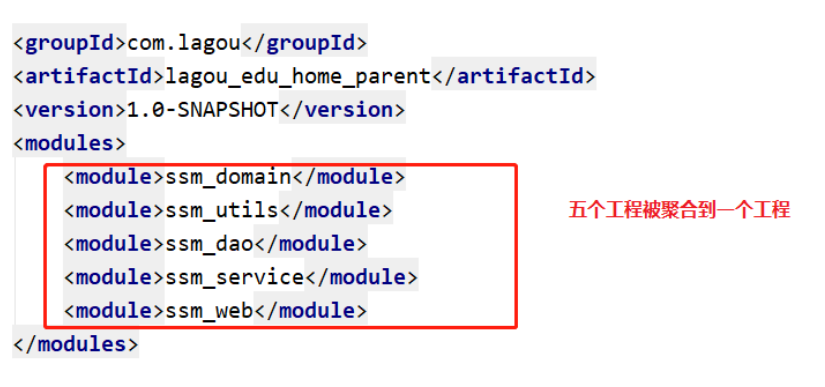

## 1. Maven 项目管理工具 

### 1.1 Maven介绍

#### 1.1.1 什么是Maven

​	Maven是一个跨平台的项目管理工具。作为Apache组织的一个颇为成功的开源项目，其主要服务于基于Java平台的项目创建，依赖管理和项目信息管理。maven是Apache的顶级项目，解释为“专家，内行”，它是一个项目管理的工具，maven自身是纯java开发的，可以使用maven对java项目进行构建、依赖管理。


#### 1.1.2 Maven的作用

- 依赖管理
  - 依赖指的就是是 我们项目中需要使用的第三方Jar包, 一个大一点的工程往往需要几十上百个Jar包,按照我们之前的方式,每使用一种Jar,就需要导入到工程中,还要解决各种Jar冲突的问题.
  - Maven可以对Jar包进行统一的管理,包括快速引入Jar包,以及对使用的 Jar包进行统一的版本控制
- 一键构建项目
  - 之前我们创建项目,需要确定项目的目录结构,比如`src` 存放Java源码, `resources`存放配置文件,还要配置环境比如JDK的版本等等,如果有多个项目 那么就需要每次自己搞一套配置,十分麻烦
  - Maven为我们提供了一个标准化的Java项目结构,我们可以通过Maven快速创建一个标准的Java项目.


### 1.2 Maven 的使用

#### 1.2.1 Maven软件的下载

使用 Maven 管理工具，我们首先要到官网去下载它的安装软件。

<http://maven.apache.org/download.cgi> 

 


目前最新版是 apache-maven-3.6.3 版本，在我们的软件文件夹中已经下载好了.

  

#### 1.2.2 Maven软件的安装

Maven 下载后，将 Maven 解压到一个没有中文没有空格的路径下，比如:H:\software\maven 下面。 解压后目录结构如下： 

  


1. bin:存放了 maven 的命令
2. boot:存放了一些 maven 本身的引导程序，如类加载器等
3. conf:存放了 maven 的一些配置文件，如 setting.xml 文件 
4. lib:存放了 maven 本身运行所需的一些 jar 包 

#### 1.2.3 Maven环境变量配置

1) 配置 MAVEN_HOME ，变量值就是你的 maven 安装的路径（bin 目录之前一级目录） 

 

2) 将MAVEN_HOME 添加到Path系统变量

 

#### 1.2.4 Maven 软件版本测试 

通过 mvn -v命令检查 maven 是否安装成功，看到 maven 的版本为 3.6.3 及 java 版本为 jdk-11 即为安装 成功。 打开命令行，输入 mvn –v命令，如下图： 

 

### 1.3 Maven 仓库

- Maven中的仓库是用来存放maven构建的项目和各种依赖的(Jar包)。 

#### 1.3.1 Maven的仓库分类

- **本地仓库**:    位于自己计算机中的仓库, 用来存储从远程仓库或中央仓库下载的插件和 jar 包，
- **远程仓库**:    需要联网才可以使用的仓库，阿里提供了一个免费的maven 远程仓库。
- **中央仓库**:    在 maven 软件中内置一个远程仓库地址 http://repo1.maven.org/maven2 ，它是中 央仓库，服务于整个互联网，它是由 Maven 团队自己维护，里面存储了非常全的 jar 包，它包 含了世界上大部分流行的开源项目构件

 

#### 1.3.2 Maven 本地仓库的配置 

1) maven仓库默认是在 C盘  .m2 目录下,我们不要将仓库放在C盘,所以这里同学们要重新配置一下.

2) 为了方便同学们的使用，老师为大家提供了一个本地仓库，将 “repository.rar”解压至自己的 电脑上，我解压在 H:\software\repository 目录下（注意最好放在没有中文及空格的目录下）。 

 


2) 在maven安装目录中,进入 conf文件夹,  可以看到一个 settings.xml 文件中, 我们在这个文件中, 进行本地仓库的配置

 


3) 打开 settings.xml文件，进行如下配置如下： 

 


#### 1.3.3 配置阿里云远程仓库

Maven默认的远程仓库是在国外, 所以下载jar包时速度会非常慢, 这里推荐大家使用我大天朝的阿里云仓库

1) 打开 settings.xml,找到 <mirrors> 标签 , 下面的内容复制到  <mirrors> 中 即可

```xml
<mirror>
    <id>alimaven</id>
    <name>aliyun maven</name>
    <url>
        http://maven.aliyun.com/nexus/content/groups/public/
    </url>
    <mirrorOf>central</mirrorOf>        
</mirror>
```

### 1.4 创建Maven项目

#### 1.4.1 IDEA中配置Maven

1) 打开IDEA 创建一个新的project


2) 起名为web_work


3) 首先打开IDEA 选择File --> Settings  --> 搜素maven,就会看到如下界面

 


2) 修改默认配置配置


#### 1.4.2 创建Maven工程

**在IDEA中配置好maven后, 接下来我们使用maven去快速的去构建一个 JavaWeb项目**

1) project创建好以后, 选择创建module

 


2) 选中创建一个 maven 工程

 


3) 点击 Next填写项目信息 

 

进行一下修改

 


4) 创建好的工程,长这个样子

 

Maven目录说明: 

```java
src/main/java 		 —— 存放项目的.java 文件 
src/main/resources 	 —— 存放项目资源文件，如数据库的配置文件 
src/test/java 		—— 存放所有单元测试.java 文件，如 JUnit 测试类 
target 			    —— 项目输出位置，编译后的class 文件会输出到此目录 
pom.xml              ——maven 项目核心配置文件 
```

#### 1.4.3 Maven工程改造

当前创建的maven项目是一个 普通的Java项目,不是web项目,我们要进行一下改造

1) 在main目录下创建一个webapp文件夹

  


2) 选择  project Structure ---> facets---> 点击+号 添加web ---> 选择当前工程hello_maven

 

 

3) 修改路径信息

 修改前 


4)修改为 我们的 webapp目录

修改后

 


5) 点击ok 后，项目就变为了web项目, 在webapp目录下再创建一个 index.jsp,就OK了

   


#### 1.4.4 pom核心配置文件

**一个 maven 工程都有一个 pom.xml 文件，通过 pom.xml 文件定义项目的信息、项目依赖、引入插件等等。** 

1) 创建一个Servlet, 缺少jar包报错, 要解决问题，就是要将 servlet-api-xxx.jar 包放进来，作为 maven 工程应当添加 servlet的坐标，从而导入它的 jar 

 


2) pom.xml 文件中引入依赖包的坐标

```xml
<?xml version="1.0" encoding="UTF-8"?>
<project xmlns="http://maven.apache.org/POM/4.0.0"
         xmlns:xsi="http://www.w3.org/2001/XMLSchema-instance"
         xsi:schemaLocation="http://maven.apache.org/POM/4.0.0 http://maven.apache.org/xsd/maven-4.0.0.xsd">
    <modelVersion>4.0.0</modelVersion>

    <groupId>com.lagou</groupId>
    <artifactId>hello_maven</artifactId>
    <version>1.0-SNAPSHOT</version>

    <dependencies>
        <dependency>
            <groupId>javax.servlet</groupId>
            <artifactId>servlet-api</artifactId>
            <version>3.1.0</version>
        </dependency>
    </dependencies>

</project>
```

3) 一个Maven工程就是由`groupId`，`artifactId `和 `version` 作为唯一标识, 我们在引用其他第三方库的时候，也是通过这3个变量确定。

- 坐标的概念
  - 在maven中坐标就是为了定位一个唯一确定的jar包。
  - maven世界拥有大量构建，我们需要找一个用来唯一标识一个构建的统一规范，拥有了统一规范，就可以把查找工作交给机器

- Maven坐标主要组成(GAV) - 确定一个jar在互联网位置 

| 标签           | 含义                                                         |
| -------------- | ------------------------------------------------------------ |
| **groupId**    | 定义当前Maven组织名称,通常是公司名                           |
| **artifactId** | 定义实际项目名称                                             |
| **version**    | 定义当前项目的当前版本                                       |
| **packaging**  | 打包类型<br />jar：执行 package 会打成 jar 包       war：执行 package 会打成 war 包 |
| **dependency** | 使用 `<dependency> `声明一个依赖后，Maven就会自动下载这个依赖包 |

4)  maven 的依赖管理, 是对项目所依赖的 jar 包进行统一管理。 

| 标签             | 含义                                                         |
| ---------------- | ------------------------------------------------------------ |
| **dependencies** | 表示依赖关系                                                 |
| **dependency**   | 使用 `<dependency> `声明一个依赖后，Maven就会自动下载这个依赖包 |

```xml
<dependencies>
    <dependency>
        <groupId>javax.servlet</groupId>
        <artifactId>servlet-api</artifactId>
        <version>3.1.0</version>
    </dependency>
</dependencies>	
```

5) 坐标的来源方式 

添加依赖需要指定依赖 jar 包的坐标，但是很多情况我们是不知道 jar 包的的坐标，可以通过如下方 式查询： 
从网站中搜索即可

5.1) 输入网址,进入网址 , 进行查询

```http
https://mvnrepository.com/
```

 

5.2)  点击进入后,可以看到各个版本的信息,选择3.1.0

 

 

#### 1.4.5 添加插件

1) 添加编译插件,  设置 jdk 编译版本 

本教程使用 jdk11，需要设置编译版本为 11，这里需要使用 maven 的插件来设置

在pom中加入如下配置: 

```xml
	<!-- properties 是全局设置,可以设置整个maven项目的编译器 JDK版本 -->
    <properties>
        <project.build.sourceEncoding>UTF-8</project.build.sourceEncoding>
        <!-- 重点  -->
        <maven.compiler.source>11</maven.compiler.source>
        <maven.compiler.target>11</maven.compiler.target>
    </properties>

    <!-- 在build中 我们需要指定一下项目的JDK编译版本,maven默认使用1.5版本进行编译
    注意 build 与 dependencies是平级关系,标签不要写错位置  -->
    <build>
        <plugins>
            <plugin>
                <groupId>org.apache.maven.plugins</groupId>
                <artifactId>maven-compiler-plugin</artifactId>
                <version>3.8.1</version>
                <configuration>
                    <release>11</release>
                </configuration>
            </plugin>
        </plugins>
    </build>
```

#### 1.4.6 运行Maven项目

1) 完善项目代码

**ServletDemo01**

```java
@WebServlet("/demo01")
public class ServletDemo01 extends HttpServlet {

    @Override
    protected void doGet(HttpServletRequest req, HttpServletResponse resp) throws ServletException, IOException {

        System.out.println("hello maven!!!!");
    }

    @Override
    protected void doPost(HttpServletRequest req, HttpServletResponse resp) throws ServletException, IOException {
        doGet(req, resp);
}
}

```

**index.jsp**

```xml
<%@ page contentType="text/html;charset=UTF-8" language="java" %>
<html>
<head>
    <title>Title</title>
</head>
<body>
    <h1>这是我的第一个maven工程!</h1>
</body>
</html>
```

2) 配置tomcat ,部署项目

 

 

3) 运行项目, 默认访问 index.jsp

 

4) 访问Servlet

```
http://localhost:8080/hello_maven/demo01


```

#### 1.4.7 Maven的常用命令

1) 一个maven项目生命周期

​	使用 maven 完成项目的构建，项目构建包括：清理、编译、测试、部署等过程，maven 将这些 过程规范为一个生命周期，如下所示是生命周期的各各阶段：  

 

maven 通过执行一些简单命令即可实现上边生命周期的各个过程

| 命令            | 说明                                                         |
| --------------- | ------------------------------------------------------------ |
| **mvn compile** | 完成编译操作 , 执行完毕后，会生成target目录，该目录中存放了编译后的字节码文件。 |
| **mvn clean**   | 执行完毕后，会将target目录删除.                              |
| **mvn test**    | 执行完毕后，会在target目录中生成三个文件夹：<br />surefire、surefire-reports（测试报告）、test-classes（测试的字节码文件） |
| **mvn package** | 完成打包操作, 执行完毕后，会在target目录中生成一个文件，该文件可能是 jar、war |
| **mvn install** | 执行 mvn install命令，完成将打好的jar包安装到本地仓库的操作 ,<br /> 执行完毕后，会在本地仓库中出现安装后的jar包，方便其他工程引用 |
|                 |                                                              |

2) idea中安装好maven后, 在界面左侧有一个maven视图, 里面有对应的命令插件,可以执行上面表格中的命令

 


3) 工具栏介绍

 

```
1.根据pom.xml文件重新导入所有Maven项目和依赖,刷新
2.创建源码（重新编译）并更新目录
3.下载源码或文档
4.添加Maven项目
5.执行生命周期中的阶段，选中lifecycle选项中生命周期中的一个阶段（phase），才能点击执行。
6.运行Maven生命周期或插件
7.切换离线模式，就是关闭和远程仓库的链接，从本地仓库中获取，也不能将jar包提交到远程仓库
8.是否跳过测试，点击选中就可以跳过测试，在点击选择取消跳过测试
9.展示当前选中的maven项目jar包的依赖，并且可以直接在图形化依赖图上进行排除依赖操作
10.收起下面展开的视图
11.跳转到maven的Setting页面


```

#### 1.4.8 依赖范围介绍

1) A 依赖 B，需要在 A 的 pom.xml 文件中添加 B 的坐标，添加坐标时需要指定依赖范围，依赖范围包 括： 

| 依赖范围 | 说明                                                         |
| -------- | ------------------------------------------------------------ |
| compile  | 编译范围，指 A在编译时依赖 B，此范围为默认依赖范围。编译范围的依赖会用在 编译、测试、运行，由于运行时需要所以编译范围的依赖会被打包。 |
| provided | provided 依赖只有在当 JDK 或者一个容器已提供该依赖之后才使用， provided 依 赖在编译和测试时需要，在运行时不需要，比如：servlet api 被 tomcat 容器提供。 |
| runtime  | runtime 依赖在运行和测试系统的时候需要，但在编译的时候不需要。比如：jdbc 的驱动包。由于运行时需要所以 runtime 范围的依赖会被打包。 |
| test     | test 范围依赖 在编译和运行时都不需要，它们只有在测试编译和测试运行阶段可用， 比如：junit。由于运行时不需要所以test范围依赖不会被打包。 |
| system   | system 范围依赖与 provided 类似，但是你必须显式的提供一个对于本地系统中 JAR 文件的路径，需要指定 systemPath 磁盘路径，system依赖不推荐使用。 |

2) 项目中添加的坐标 ,并指定依赖范围

```xml
	<dependencies>
        <dependency>
            <!-- 项目名称 -->
            <groupId>javax.servlet</groupId>
            <!-- 模块名称 -->
            <artifactId>servlet-api</artifactId>
            <!-- 版本信息 -->
            <version>3.1.0</version>
        <!-- 依赖范围, 指定依赖范围是编译与测试时有效,运行时无效,运行时使用tomcat中的依赖,避免冲突 -->
            <scope>provided</scope>
        </dependency>

        <dependency>
            <groupId>javax.servlet.jsp</groupId>
            <artifactId>jsp-api</artifactId>
            <version>2.1.2</version>
            <scope>provided</scope>
        </dependency>

        <dependency>
            <groupId>junit</groupId>
            <artifactId>junit</artifactId>
            <version>4.13</version>

            <!-- 在测试时有效 -->
            <scope>test</scope>
        </dependency>
    </dependencies>


```


## 2.Maven进阶使用（Maven聚合工程）

### 2.1 maven基础知识回顾

#### 2.1.1 maven介绍

maven 是一个项目管理工具，主要作用是在项目开发阶段对Java项目进行依赖管理和项目构建。

依赖管理：就是对jar包的管理。通过导入maven坐标，就相当于将仓库中的jar包导入了当前项目中。

项目构建：通过maven的一个命令就可以完成项目从清理、编译、测试、报告、打包，部署整个过程。

```
清理→编译→测试→报告→打包→部署
```

#### 2.1.2 maven的仓库类型

1.本地仓库
2.远程仓库
①maven中央仓库（地址：http://repo2.maven.org/maven2/）
②maven私服（公司局域网内的仓库，需要自己搭建）
③其他公共远程仓库（例如apache提供的远程仓库，地址：
http://repo.maven.apache.org/maven2/）
本地仓库---》maven私服---》maven中央仓库

#### 2.1.3 maven常用命令

```
clean： 清理
compile：编译
test： 测试
package：打包
install： 安装
```

#### 2.1.4 maven坐标书写规范

```
		<dependency>
            <!-- 项目名称 -->
            <groupId>javax.servlet</groupId>
            <!-- 模块名称 -->
            <artifactId>servlet-api</artifactId>
            <!-- 版本信息 -->
            <version>3.1.0</version>
        <!-- 依赖范围, 指定依赖范围是编译与测试时有效,运行时无效,运行时使用tomcat中的依赖,避免冲突 -->
            <scope>provided</scope>
        </dependency>
```

### 2.2 maven的依赖传递

#### 2.2.1 什么是依赖传递

在maven中，依赖是可以传递的，假设存在三个项目，分别是项目A，项目B以及项目C。假设C依赖
B，B依赖A，那么我们可以根据maven项目依赖的特征不难推出项目C也依赖A。


通过上面的图可以看到，我们的web项目直接依赖了spring-webmvc，而spring-webmvc依赖了spingaop、spring-beans等。最终的结果就是在我们的web项目中间接依赖了spring-aop、spring-beans
等

**依赖冲突**
由于依赖传递现象的存在， spring-webmvc 依赖 spirng-beans-5.1.5，spring-aop 依赖 spring-beans-5.1.6，但是发现 spirng-beans-5.1.5 加入到了工程中，而我们希望 spring-beans-5.1.6 加入工
程。这就造成了依赖冲突


#### 2.2.2 如何解决依赖冲突

```
1.使用maven提供的依赖调解原则
	 第一声明者优先原则
	 路径近者优先原则
2.排除依赖
3.锁定版本
```

#### 2.2.3 依赖调节原则——第一声明者优先原则

在 pom 文件中定义依赖，以先声明的依赖为准。其实就是根据坐标导入的顺序来确定最终使用哪个传
递过来的依赖。


结论：通过上图可以看到，spring-aop和spring-webmvc都传递过来了spring-beans，但是因为
spring-aop在前面，所以最终使用的spring-beans是由spring-aop传递过来的，而spring-webmvc传递
过来的spring-beans则被忽略了。

#### 2.2.4 依赖调节原则——路径近者优先原则


总结：直接依赖大于依赖传递

#### 2.2.5 排除依赖

可以使用exclusions标签将传递过来的依赖排除出去。


#### 2.2.6 版本锁定(只有锁定版本的作用，没有引入jar包的作用 )

采用直接锁定版本的方法确定依赖jar包的版本，版本锁定后则不考虑依赖的声明顺序或依赖的路径，以
锁定的版本为准添加到工程中，此方法在企业开发中经常使用。
版本锁定的使用方式：
第一步：在dependencyManagement标签中锁定依赖的版本
第二步：在dependencies标签中声明需要导入的maven坐标
①在dependencyManagement标签中锁定依赖的版本


②在dependencies标签中声明需要导入的maven坐标


```
只有锁定版本的作用，没有引入jar包的作用
同时配置了的jar包进行引入可以不用进行版本的配置
```


#### 2.2.7 properties标签的使用

```
    <properties>
        <spring.version>5.1.5.RELEASE</spring.version>
        <springmvc.version>5.1.5.RELEASE</springmvc.version>
        <mybatis.version>3.5.1</mybatis.version>
    </properties>

    <!--锁定jar版本-->
    <dependencyManagement>
        <dependencies>
            <!-- Mybatis -->
            <dependency>
                <groupId>org.mybatis</groupId>
                <artifactId>mybatis</artifactId>
                <version>${mybatis.version}</version>
            </dependency>
            <!-- springMVC -->
            <dependency>
                <groupId>org.springframework</groupId>
                <artifactId>spring-webmvc</artifactId>
                <version>${springmvc.version}</version>
            </dependency>
            <!-- spring -->
            <dependency>
                <groupId>org.springframework</groupId>
                <artifactId>spring-context</artifactId>
                <version>${spring.version}</version>
            </dependency>
            <dependency>
                <groupId>org.springframework</groupId>
                <artifactId>spring-core</artifactId>
                <version>${spring.version}</version>
            </dependency>
            <dependency>
                <groupId>org.springframework</groupId>
                <artifactId>spring-aop</artifactId>
                <version>${spring.version}</version>
            </dependency>
            <dependency>
                <groupId>org.springframework</groupId>
                <artifactId>spring-web</artifactId>
                <version>${spring.version}</version>
            </dependency>
            <dependency>
                <groupId>org.springframework</groupId>
                <artifactId>spring-expression</artifactId>
                <version>${spring.version}</version>
            </dependency>
            <dependency>
                <groupId>org.springframework</groupId>
                <artifactId>spring-beans</artifactId>
                <version>${spring.version}</version>
            </dependency>
            <dependency>
                <groupId>org.springframework</groupId>
                <artifactId>spring-aspects</artifactId>
                <version>${spring.version}</version>
            </dependency>
            <dependency>
                <groupId>org.springframework</groupId>
                <artifactId>spring-context-support</artifactId>
                <version>${spring.version}</version>
            </dependency>
            <dependency>
                <groupId>org.springframework</groupId>
                <artifactId>spring-test</artifactId>
                <version>${spring.version}</version>
            </dependency>
            <dependency>
                <groupId>org.springframework</groupId>
                <artifactId>spring-jdbc</artifactId>
                <version>${spring.version}</version>
            </dependency>
            <dependency>
                <groupId>org.springframework</groupId>
                <artifactId>spring-tx</artifactId>
                <version>${spring.version}</version>
            </dependency>
        </dependencies>
    </dependencyManagement>
```


### 2.3 maven聚合工程（分模块)

概念:

	在现实生活中，汽车厂家进行汽车生产时，由于整个生产过程非常复杂和繁琐，工作量非常大，所以厂家都会将整个汽车的部件分开生产，最终再将生产好的部件进行组装，形成一台完整的汽车

#### 2.3.1 分模块构建maven工程分析

在企业项目开发中，由于项目规模大，业务复杂，参与的人员比较多，一般会通过合理的模块拆分将一
个大型的项目拆分为N多个小模块，分别进行开发。而且拆分出的模块可以非常容易的被其他模块复用
常见的拆分方式有两种：
第一种：按照业务模块进行拆分，每个模块拆分成一个maven工程，例如将一个项目分为用户模块，订
单模块，购物车模块等，每个模块对应就是一个maven工程
第二种：按照层进行拆分，例如持久层、业务层、表现层等，每个层对应就是一个maven工程
不管上面那种拆分方式，通常都会提供一个父工程，将一些公共的代码和配置提取到父工程中进行统一
管理和配置


#### 2.3.2 maven工程的继承

在Java语言中，类之间是可以继承的，通过继承，子类就可以引用父类中非private的属性和方法。同
样，在maven工程之间也可以继承，子工程继承父工程后，就可以使用在父工程中引入的依赖。继承的
目的是为了消除重复代码。


maven_parent的pom.xml

```
	<groupId>com.lagou</groupId>
    <artifactId>maven_parent</artifactId>
    <version>1.0-SNAPSHOT</version>
    <modules>
        <module>maven_children1</module>
    </modules>

    <packaging>pom</packaging>

    <dependencies>
        <dependency>
            <groupId>org.mybatis</groupId>
            <artifactId>mybatis</artifactId>
            <version>3.5.5</version>
        </dependency>
    </dependencies>
```

maven_children的pom.xml

```
	<parent>
        <artifactId>maven_parent</artifactId>
        <groupId>com.lagou</groupId>
        <version>1.0-SNAPSHOT</version>
    </parent>
    <modelVersion>4.0.0</modelVersion>

    <artifactId>maven_children1</artifactId>
```


#### 2.3.3 maven工程的聚合

在maven工程的pom.xml文件中可以使用标签将其他maven工程聚合到一起，聚合的目的是为了进行
统一操作。
例如拆分后的maven工程有多个，如果要进行打包，就需要针对每个工程分别执行打包命令，操作起来
非常繁琐。这时就可以使用标签将这些工程统一聚合到maven父工程中，需要打包的时候，只需要在此
工程中执行一次打包命令，其下被聚合的工程就都会被打包了。



#### 2.3.3 maven聚合工程_搭建拉勾教育后台管理系统

工程整体结构如下：
1）lagou_edu_home_parent为父工程，其余工程为子工程，都继承父工程lagou_edu_home_parent
2）lagou_edu_home_parent工程将其子工程都进行了聚合
3）子工程之间存在依赖关系：

		ssm_domain依赖ssm_utils
		ssm_dao依赖ssm_domain
		ssm_service依赖ssm_dao
		ssm_web依赖ssm_service
① 父工程lagou_edu_home_parent构建
修改pom.xml,添加依赖

```xml
    <properties>
        <spring.version>5.1.5.RELEASE</spring.version>
        <springmvc.version>5.1.5.RELEASE</springmvc.version>
        <mybatis.version>3.5.1</mybatis.version>
    </properties>
    <!--锁定jar版本-->
    <dependencyManagement>
        <dependencies>
            <!-- Mybatis -->
            <dependency>
                <groupId>org.mybatis</groupId>
                <artifactId>mybatis</artifactId>
                <version>${mybatis.version}</version>
            </dependency>
            <!-- springMVC -->
            <dependency>
                <groupId>org.springframework</groupId>
                <artifactId>spring-webmvc</artifactId>
                <version>${springmvc.version}</version>
            </dependency>
            <!-- spring -->
            <dependency>
                <groupId>org.springframework</groupId>
                <artifactId>spring-context</artifactId>
                <version>${spring.version}</version>
            </dependency>
            <dependency>
                <groupId>org.springframework</groupId>
                <artifactId>spring-core</artifactId>
                <version>${spring.version}</version>
            </dependency>
            <dependency>
                <groupId>org.springframework</groupId>
                <artifactId>spring-aop</artifactId>
                <version>${spring.version}</version>
            </dependency>
            <dependency>
                <groupId>org.springframework</groupId>
                <artifactId>spring-web</artifactId>
                <version>${spring.version}</version>
            </dependency>
            <dependency>
                <groupId>org.springframework</groupId>
                <artifactId>spring-expression</artifactId>
                <version>${spring.version}</version>
            </dependency>
            <dependency>
                <groupId>org.springframework</groupId>
                <artifactId>spring-beans</artifactId>
                <version>${spring.version}</version>
            </dependency>
            <dependency>
                <groupId>org.springframework</groupId>
                <artifactId>spring-aspects</artifactId>
                <version>${spring.version}</version>
            </dependency>
            <dependency>
                <groupId>org.springframework</groupId>
                <artifactId>spring-context-support</artifactId>
                <version>${spring.version}</version>
            </dependency>
            <dependency>
                <groupId>org.springframework</groupId>
                <artifactId>spring-test</artifactId>
                <version>${spring.version}</version>
            </dependency>
            <dependency>
                <groupId>org.springframework</groupId>
                <artifactId>spring-jdbc</artifactId>
                <version>${spring.version}</version>
            </dependency>
            <dependency>
                <groupId>org.springframework</groupId>
                <artifactId>spring-tx</artifactId>
                <version>${spring.version}</version>
            </dependency>
        </dependencies>
    </dependencyManagement>
        
        
    <dependencies>
        <!--mybatis坐标-->
        <dependency>
            <groupId>mysql</groupId>
            <artifactId>mysql-connector-java</artifactId>
            <version>5.1.47</version>
        </dependency>
        <dependency>
            <groupId>com.alibaba</groupId>
            <artifactId>druid</artifactId>
            <version>1.1.15</version>
        </dependency>
        <dependency>
            <groupId>org.mybatis</groupId>
            <artifactId>mybatis</artifactId>
        </dependency>
        <dependency>
            <groupId>junit</groupId>
            <artifactId>junit</artifactId>
            <version>4.12</version>
        </dependency>
        <!--spring坐标-->
        <dependency>
            <groupId>org.springframework</groupId>
            <artifactId>spring-context</artifactId>
        </dependency>
        <dependency>
            <groupId>org.aspectj</groupId>
            <artifactId>aspectjweaver</artifactId>
            <version>1.8.13</version>
        </dependency>
        <dependency>
            <groupId>org.springframework</groupId>
            <artifactId>spring-jdbc</artifactId>
        </dependency>
        <dependency>
            <groupId>org.springframework</groupId>
            <artifactId>spring-tx</artifactId>
        </dependency>
        <dependency>
            <groupId>org.springframework</groupId>
            <artifactId>spring-test</artifactId>
        </dependency>
        <!--mybatis整合spring坐标-->
        <dependency>
            <groupId>org.mybatis</groupId>
            <artifactId>mybatis-spring</artifactId>
            <version>1.3.1</version>
        </dependency>
        <!--springMVC坐标-->
        <dependency>
            <groupId>org.springframework</groupId>
            <artifactId>spring-webmvc</artifactId>
        </dependency>
        <dependency>
            <groupId>javax.servlet</groupId>
            <artifactId>javax.servlet-api</artifactId>
            <version>3.1.0</version>
            <scope>provided</scope>
        </dependency>
        <dependency>
            <groupId>javax.servlet.jsp</groupId>
            <artifactId>jsp-api</artifactId>
            <version>2.2</version>
            <scope>provided</scope>
        </dependency>
        <dependency>
            <groupId>jstl</groupId>
            <artifactId>jstl</artifactId>
            <version>1.2</version>
        </dependency>
        <dependency>
            <groupId>com.fasterxml.jackson.core</groupId>
            <artifactId>jackson-databind</artifactId>
            <version>2.9.8</version>
        </dependency>
        <dependency>
            <groupId>com.fasterxml.jackson.core</groupId>
            <artifactId>jackson-core</artifactId>
            <version>2.9.8</version>
        </dependency>
        <dependency>
            <groupId>com.fasterxml.jackson.core</groupId>
            <artifactId>jackson-annotations</artifactId>
            <version>2.9.0</version>
        </dependency>
        <dependency>
            <groupId>com.github.pagehelper</groupId>
            <artifactId>pagehelper</artifactId>
            <version>4.1.6</version>
        </dependency>
        <!-- Beanutils -->
        <dependency>
            <groupId>commons-beanutils</groupId>
            <artifactId>commons-beanutils</artifactId>
            <version>1.8.3</version>
        </dependency>
        <dependency>
            <groupId>commons-fileupload</groupId>
            <artifactId>commons-fileupload</artifactId>
            <version>1.3.1</version>
        </dependency>
        <!-- 解决跨域问题所需依赖 -->
        <dependency>
            <groupId>com.thetransactioncompany</groupId>
            <artifactId>cors-filter</artifactId>
            <version>2.5</version>
        </dependency>
    </dependencies>
    <build>
        <plugins>
            <plugin>
                <groupId>org.apache.maven.plugins</groupId>
                <artifactId>maven-compiler-plugin</artifactId>
                <version>3.1</version>
                <configuration>
                    <source>1.8</source>
                    <target>1.8</target>
                    <encoding>UTF-8</encoding>
                </configuration>
            </plugin>
        </plugins>
    </build>
```

② 子工程ssm_utils构建

③ 子工程ssm_domain构建

引入依赖

```xml
	<dependencies>
        <dependency>
            <groupId>com.lagou</groupId>
            <artifactId>ssm_utils</artifactId>
            <version>1.0-SNAPSHOT</version>
        </dependency>
    </dependencies>
```

④ 子工程ssm_dao构建
配置ssm_domain工程的pom.xml文件

```xml
	<dependencies>
        <dependency>
            <groupId>com.lagou</groupId>
            <artifactId>ssm_domain</artifactId>
            <version>1.0-SNAPSHOT</version>
        </dependency>
    </dependencies>
```

创建DAO接口和Mapper映射文件

```
public interface TestMapper {

    /**
     * 对test表进行查询所有
     */
    public List<Test> findAllTest();
}
```


```
<?xml version="1.0" encoding="UTF-8" ?>
<!DOCTYPE mapper PUBLIC "-//mybatis.org//DTD Mapper 3.0//EN"
        "http://mybatis.org/dtd/mybatis-3-mapper.dtd">
<mapper namespace="com.lagou.dao.TestMapper">
    <select id="findAllTest" resultType="com.lagou.domain.Test">
        select * from test
    </select>
</mapper>
```

在resources目录下创建spring配置文件applicationContext-dao.xml

```
<?xml version="1.0" encoding="UTF-8"?>
<beans xmlns="http://www.springframework.org/schema/beans"
       xmlns:xsi="http://www.w3.org/2001/XMLSchema-instance"
       xmlns:context="http://www.springframework.org/schema/context"
       xmlns:tx="http://www.springframework.org/schema/tx"
       xmlns:aop="http://www.springframework.org/schema/aop"
       xsi:schemaLocation="http://www.springframework.org/schema/beans
        http://www.springframework.org/schema/beans/spring-beans.xsd
        http://www.springframework.org/schema/context
        http://www.springframework.org/schema/context/spring-context.xsd
        http://www.springframework.org/schema/tx
        http://www.springframework.org/schema/tx/spring-tx.xsd
        http://www.springframework.org/schema/aop
        http://www.springframework.org/schema/aop/spring-aop.xsd">


    <context:property-placeholder location="classpath:jdbc.properties"/>

    <bean id="dataSource" class="com.alibaba.druid.pool.DruidDataSource">
        <property name="driverClassName" value="${jdbc.driver}"/>
        <property name="url" value="${jdbc.url}"/>
        <property name="username" value="${jdbc.username}"/>
        <property name="password" value="${jdbc.password}"/>
    </bean>

    <!--spring整合mybatis-->
    <bean id="sqlSessionFactory" class="org.mybatis.spring.SqlSessionFactoryBean">
        <property name="dataSource" ref="dataSource"/>
        <property name="typeAliasesPackage" value="com.lagou.domain"/>
        <!--引入加载Mybatis核心配置文件-->
        <property name="configLocation" value="classpath:SqlMapConfig.xml"/>
    </bean>

    <bean class="org.mybatis.spring.mapper.MapperScannerConfigurer">
        <property name="basePackage" value="com.lagou.dao"/>
    </bean>

</beans>
```

引入数据库连接配置文件

```
jdbc.driver=com.mysql.jdbc.Driver
jdbc.url=jdbc:mysql:///spring_db?characterEncoding=utf-8&useSSL=false
jdbc.username=root
jdbc.password=123456
```

引入mybatis核心配置文件

```
<?xml version="1.0" encoding="UTF-8"?>
<!DOCTYPE configuration PUBLIC "-//mybatis.org//DTD Config 3.0//EN"
        "http://mybatis.org/dtd/mybatis-3-config.dtd">
<configuration>
    <settings>
        <!-- 是否开启自动驼峰命名规则（camel case）映射，即从数据库列名 A_COLUMN 到属性名
        aColumn 的类似映射 a_name aName-->
        <setting name="mapUnderscoreToCamelCase" value="true"/>
    </settings>
</configuration>
```

⑤子工程ssm_service构建
 第一步：创建ssm_service工程
 第二步：配置ssm_service工程的pom.xml文件

```
	<dependencies>
        <dependency>
            <groupId>com.lagou</groupId>
            <artifactId>ssm_dao</artifactId>
            <version>1.0-SNAPSHOT</version>
        </dependency>
    </dependencies>
```

第三步：创建TestService接口和实现类

```
public interface TestService {
    /**
     * 对test表进行查询所有
     */
    public List<Test> findAllTest();
}
```

```
@Service
public class TestServiceImpl implements TestService {

    @Autowired
    private TestMapper testMapper;
    @Override
    public List<Test> findAllTest() {
        return testMapper.findAllTest();
    }
}
```


第四步：创建spring配置文件applicationContext-service.xml

```
<?xml version="1.0" encoding="UTF-8"?>
<beans xmlns="http://www.springframework.org/schema/beans"
       xmlns:xsi="http://www.w3.org/2001/XMLSchema-instance"
       xmlns:context="http://www.springframework.org/schema/context"
       xmlns:tx="http://www.springframework.org/schema/tx"
       xmlns:aop="http://www.springframework.org/schema/aop"
       xsi:schemaLocation="
        http://www.springframework.org/schema/beans
        http://www.springframework.org/schema/beans/spring-beans.xsd
        http://www.springframework.org/schema/context
        http://www.springframework.org/schema/context/spring-context.xsd
        http://www.springframework.org/schema/tx
        http://www.springframework.org/schema/tx/spring-tx.xsd
        http://www.springframework.org/schema/aop
        http://www.springframework.org/schema/aop/spring-aop.xsd">
    
    <!--开启注解扫描-->
    <context:component-scan base-package="com.lagou.service"/>

    <!--引入dao层的核心配置文件-->
    <import resource="classpath:applicationContext-dao.xml"/>

</beans>
```

⑥子工程ssm_web构建
 第一步：创建maven_web工程，注意打包方式为war

```
<packaging>war</packaging>
```

 第二步：配置maven_web工程的pom.xml文件

```
	<dependencies>
        <dependency>
            <groupId>com.lagou</groupId>
            <artifactId>ssm_service</artifactId>
            <version>1.0-SNAPSHOT</version>
        </dependency>
    </dependencies>
```

第三步：创建Controller

```
@RestController     //@Controller+@ResponseBody
@RequestMapping("/test")
public class TestController {

    @Autowired
    private TestService testService;
    
    /**
     * 因为有@ResponseBody
     * 直接返回list集合，会将list集合转成String字符串，
     * 转换成JSON相应到页面
     */
    @RequestMapping("/findAllTest")
    public List<Test> findAllTest(){
        List<Test> list = testService.findAllTest();
        return list;

    }
}
```

 第四步： 创建springmvc配置文件springmvc.xml

```
<beans xmlns="http://www.springframework.org/schema/beans"
       xmlns:mvc="http://www.springframework.org/schema/mvc"
       xmlns:context="http://www.springframework.org/schema/context"
       xmlns:xsi="http://www.w3.org/2001/XMLSchema-instance"
       xsi:schemaLocation="http://www.springframework.org/schema/beans
        http://www.springframework.org/schema/beans/spring-beans.xsd
        http://www.springframework.org/schema/mvc
        http://www.springframework.org/schema/mvc/spring-mvc.xsd
        http://www.springframework.org/schema/context
        http://www.springframework.org/schema/context/spring-context.xsd">
    <!--1.组件扫描-->
    <context:component-scan base-package="com.lagou.controller"/>

    <!--2.mvc注解增强-->
    <mvc:annotation-driven/>

    <!--3.视图解析器-->
    <bean id="resourceViewResolver" class="org.springframework.web.servlet.view.InternalResourceViewResolver">
        <property name="prefix" value="/"/>
        <property name="suffix" value=""/>
    </bean>

    <!--4.静态资源放行-->
    <mvc:default-servlet-handler/>

</beans>
```

第五步：编写applicationContext.xml,加载service层的核心配置文件

```
<?xml version="1.0" encoding="UTF-8"?>
<beans xmlns="http://www.springframework.org/schema/beans"
       xmlns:xsi="http://www.w3.org/2001/XMLSchema-instance"
       xmlns:context="http://www.springframework.org/schema/context"
       xmlns:tx="http://www.springframework.org/schema/tx"
       xmlns:aop="http://www.springframework.org/schema/aop"
       xsi:schemaLocation="
http://www.springframework.org/schema/beans
http://www.springframework.org/schema/beans/spring-beans.xsd
http://www.springframework.org/schema/context
http://www.springframework.org/schema/context/spring-context.xsd
http://www.springframework.org/schema/tx
http://www.springframework.org/schema/tx/spring-tx.xsd
http://www.springframework.org/schema/aop
http://www.springframework.org/schema/aop/spring-aop.xsd">
    <!--引入：applicationContext_service.xml-->
    <import resource="classpath:applicationContext-service.xml"/>
</beans>

```

第六步：配置web.xml

```
<?xml version="1.0" encoding="UTF-8"?>
<web-app xmlns="http://xmlns.jcp.org/xml/ns/javaee"
         xmlns:xsi="http://www.w3.org/2001/XMLSchema-instance"
         xsi:schemaLocation="http://xmlns.jcp.org/xml/ns/javaee http://xmlns.jcp.org/xml/ns/javaee/web-app_4_0.xsd"
         version="4.0">

    <!--前端控制器-->
    <servlet>
        <servlet-name>dispatcherServlet</servlet-name>
        <servlet-class>org.springframework.web.servlet.DispatcherServlet</servlet-class>
        <init-param>
            <param-name>contextConfigLocation</param-name>
            <param-value>classpath:springmvc.xml</param-value>
        </init-param>
        <load-on-startup>2</load-on-startup>
    </servlet>
    
    <servlet-mapping>
        <servlet-name>dispatcherServlet</servlet-name>
        <url-pattern>/</url-pattern>
        <!--    /表示对请求进行拦截，不对页面拦截-->
    </servlet-mapping>


    <!--中文乱码过滤器-->
    <filter>
        <filter-name>encodingFilter</filter-name>
        <filter-class>
        	org.springframework.web.filter.CharacterEncodingFilter
        </filter-class>
        <init-param>
            <param-name>encoding</param-name>
            <param-value>utf-8</param-value>
        </init-param>
    </filter>
    <filter-mapping>
        <filter-name>encodingFilter</filter-name>
        <url-pattern>/*</url-pattern>
    </filter-mapping>

    <!--监听器ContextLoadistener-->
    <listener>
        <listener-class>
        	org.springframework.web.context.ContextLoaderListener
        </listener-class>
    </listener>
    <context-param>
        <param-name>contextConfigLocation</param-name>
        <param-value>classpath:applicationContext.xml</param-value>
    </context-param>

    <!--配置跨域过滤器-->
    <filter>
        <filter-name>corsFilter</filter-name>
        <filter-class>com.thetransactioncompany.cors.CORSFilter</filter-class>
    </filter>
    <filter-mapping>
        <filter-name>corsFilter</filter-name>
        <url-pattern>/*</url-pattern>
    </filter-mapping>
    
</web-app>
```

