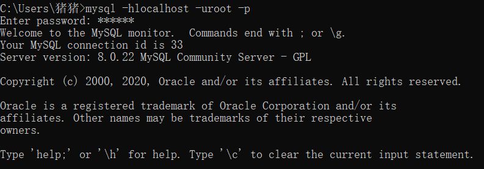
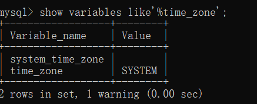
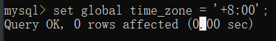
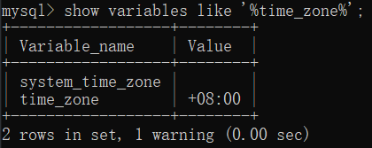

## idea连接数据库出错

报错：

```
Server returns invalid timezone. Go to 'Advanced' tab and set 'serverTimezon
```

IDEA连接mysql，地址，用户名，密码，数据库名，全都配置好了，点测试连接，咔！不成功！

# 解决方案

我的问题出在两块，第一，设置mysql的时区。第二，mysql驱动的版本。详细步骤如下：

## 第一，设置mysql时区。

1，我们先来检查下mysql时区。

( 这里有个小插曲~~~~~~~你的mysql，配置好环境变量了吗 ）

配置完环境变量，就可以在命令窗口直接执行下面的命令啦！

进入命令窗口（Win + R），连接数据库 mysql -hlocalhost -uroot -p，回车，输入密码，回车，如图：



2，继续输入 show variables like'%time_zone';  （注意不要漏掉后面的分号），回车，如图：




显示 SYSTEM 就是没有设置时区啦。

3，现在我们来设置时区。

输入set global time_zone = '+8:00'; 注意不要漏掉后面的分号），回车，如图：

```
set global time_zone = '+8:00';
# 将全局时区修改为东8区，即北京时间
```



```
set time_zone = '+8:00';
# 将当前会话的时区修改为东8区，即北京时间
```


```
flush privileges;
# 让时区立即生效
```


重新查看

```
show variables like '%time_zone%';
```

