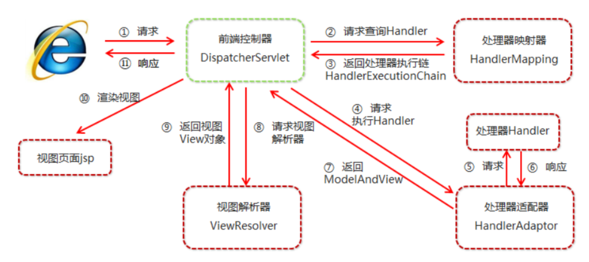

## list和set的区别

list，set都是继承自Collection接口

list特点：元素放入有序，元素可重复，lis支持for循环遍历，也可以使用迭代器

set特点：元素放入无序，元素不可重复，重复元素会覆盖(元素位置虽然无序，但是元素在set集合中的位置是由该元素的hashCode决定的，其位置其实是固定的，加入set的objec必须定义equals(0方法)。set集合只能使用迭代器，因为它是无序的。

list和set对比：

```
set:检索元素效率低下，删除和插入效率高，插入和删除不会引起元素位置的改变
```

```
list：和数组类似，list可以动态增长，查找元素高，插入删除元素效率低，因为会引起其他元素位置改变
```

### HashSet如何保证不重复

向HashSet中add()元素时，判断元素是否存在的依据，不仅要比较hash值，同时还要结合equals()方法比较。

add()方法会使用HasnMap的add()方法


### final finally finalize

*final可以修饰类，变量，方法，修饰类表示噶类不能被继承、修饰方法表示该类布恩那个被重写、修饰变量表示该变量不能被重新赋值

*finally一般作用在try-catch代码块中，在处理异常的时候，finally代码块中无论是否出现异常，该代码块都会执行，一般用来存放一些关闭资源的方法

*finalize是一个方法，属于Object类的方法，而Objec类是所有类的父类，该方法一般由垃圾回收器来调用。当我们调用 System.gc() 方法的时候，由垃圾回收器调用finalize()，回收垃圾，一个对象是否可回收的最后判断


### Java获取反射的三种方法

1.通过new对象实现反射机制

```
Student stu = nw Student();
Class classObj1 = stu.getClass();
```

2.通过路径实现反射机制

```
Class classObj2= Class.forName("Student");
```

3.通过类名实现反射机制

```
Class classObj3 = Student.class;
```


### Java反射机制

Java反射机制实在运行状态中，对于任意一个类，都能够获得这个类的所有属性和方法


### 怎么利用反射获取类中的对象？

### 说说你对 Java 反射的理解


### Collection和Collections区别


### 说说 Aop 和 IOC 的应用

### Spring 中 bean 是线程安全的吗？

### Maven 中 package 和 install 区别


### 静态代理和动态代理的区别，什么场景使用？

代理是一种常用的设计模式，它的目的是：为其他对象提供一个代理以控制对都个对象的访问，将两个类的关系解耦。

代理类和委托类都要实现相同的接口，因为代理真正调用的是委托类的方法。


区别：

*静态代理：由程序员创建或是特定工具生成，在代码编译时就确定了被代理的类是哪一个是静态代理。静态代理通常只代理一个类；


*动态代理：在代码运行期间，运用反射机制动态创建生成。动态代理代理的是一个接口下的多个实现类。

```
动态代理的实现步骤：

​	1.实现InvocationHandler接口创建自己的调用处理器；
​	2.重写接口的方法，给Proxy类提供ClassLoader和代理接口类型数组创建动态代理类
​	3.利用反射机制得到动态代理类的构造函数
​	4.利用动态代理类的构造函数创建动态代理对象
```

使用场景：Sping的AOP机制


### Java 的异常体系

Java中的Throwable是所有异常和错误的超类，两个直接子类是Error和Exception；

*Error是程序无法处理的错误，由JVM产生和抛出，如OOM、ThreadDeath等。这些异常发生时JVM一般都会选择终止程序


*Exception是程序本身可以处理的异常，又分为RuntimeException和UncheckedException。

RuntimeException包含NullPointerException/IndexOutOfBoundsException等，这些一场一般是由程序逻辑错误引起的，应尽可能避免。

非运行时异常有IOException/SQLException/FileNotFoundExceptio以及由用户自定义的Exception异常等。

### Java 中实现多态的机制是什么？

### 说说你对 Java 注解的理解


### SptingMVC流程？



*用户发送请求到前端控制器DispatcherServlet

*DispacherServlet收到请求调用HandlerMapping处理器映射器

*处理器映射器找到具体的处理器生成**处理器映射器对象以及处理器拦截器(**如果有生成)一并返回给DispacherServlet

```
具体的处理器如何生成？
根据xml配置、注解进行查找
【系统启动的时候根据配置文件创建springIOC的容器，Spring容器通过处理器映射器去寻找业务控制器】
```

*DispatcherServlet根据返回的Handler对象调用HandlerAdapter处理器适配器

*处理器适配器调用具体的处理器(controller)

*controller执行完成后返回ModelAndView

*处理器适配器将controller执行结果MOdelAndView返回给前端控制器

*前端控制器将ModelAndView传给视图解析器ViewReslover

*视图解析器解析后返回具体的View

*前端控制器根据View进行视图渲染(将模型数据填充到视图中)

*前端控制器响应用户


### SpringMVC的执行流程

*系统启动的时候根据配置文件创建springIOC的容器

*发送http请求到前端控制器DispatherServlet，Spring容器通过处理器映射器去寻找业务控制器

*通过处理器适配器找到响应的业务类，调用业务类进行数据封装，在封装前涉及到类型转换

*执行完业务类后，使用ModelAndView进行试图转发，将数据放到model中，用map传递数据进行页面展示